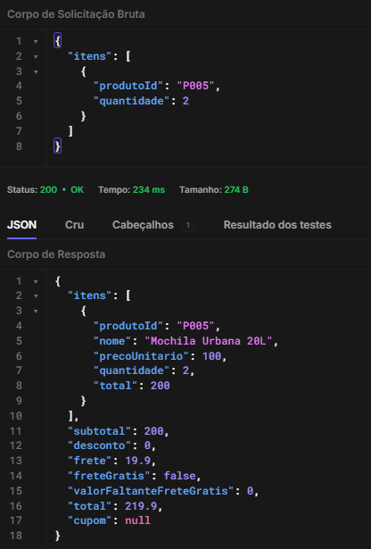

# BUG-001 - Frete cobrado para subtotal de exatamente R$ 200,00

## Resumo

Ao atingir o subtotal de exatamente R$ 200,00, o sistema cobra R$ 19,90 de frete, embora a regra de negócio determine frete grátis para compras com subtotal a partir de R$ 200,00, inclusive.

## Critério relacionado

CA06 - O frete é grátis para compras com subtotal a partir de R$ 200,00, inclusive.
CA07 - Abaixo de R$ 200,00, é cobrado frete fixo de R$ 19,90 e o carrinho informa quanto falta para o frete grátis.

## Severidade

Alta

## Ambiente

Verzel Store - Ambiente de QA

## Pré-condição

Carrinho vazio.

## Passos para reprodução

1. Acessar a Verzel Store.
2. Adicionar 2 unidades do produto P005 - Mochila Urbana 20L, no valor de R$ 100,00 cada.
3. Acessar o carrinho.
4. Observar o subtotal e o valor do frete.

## Dados utilizados

- Produto: P005 - Mochila Urbana 20L
- Preço unitário: R$ 100,00
- Quantidade: 2
- Subtotal: R$ 200,00

## Resultado esperado

O sistema deve considerar o pedido elegível para frete grátis:

- Subtotal: R$ 200,00
- Frete: R$ 0,00
- Frete grátis: Sim
- Valor faltante para frete grátis: R$ 0,00
- Total: R$ 200,00

## Resultado obtido

O sistema cobra frete mesmo com o subtotal exatamente no limite definido pela regra:

- Subtotal: R$ 200,00
- Frete: R$ 19,90
- Frete grátis: Não
- Valor faltante para frete grátis: R$ 0,00
- Total: R$ 219,90

## Reprodução via API

Endpoint:

POST /api/carrinho/calcular

Payload:

```
{
  "itens": [
    {
      "produtoId": "P005",
      "quantidade": 2
    }
  ]
}
```

A API também retorna frete de R$ 19,90 e `freteGratis: false` para subtotal de R$ 200,00.

## Impacto

O cliente é cobrado indevidamente pelo frete ao realizar uma compra exatamente no valor mínimo estabelecido para frete grátis.

O problema afeta o cálculo realizado pela API e é refletido na interface da loja.

## Evidências

### Interface


### via API

A API retorna frete de R$ 19,90 para um carrinho com subtotal de
exatamente R$ 200,00, apesar de indicar que o valor faltante para
frete grátis é R$ 0,00.



### Automação

O defeito possui cenário automatizado de reprodução na suíte `known-bugs`.
