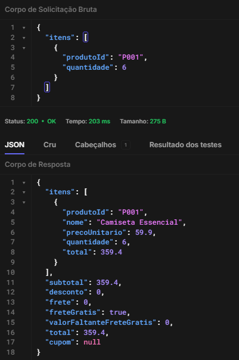
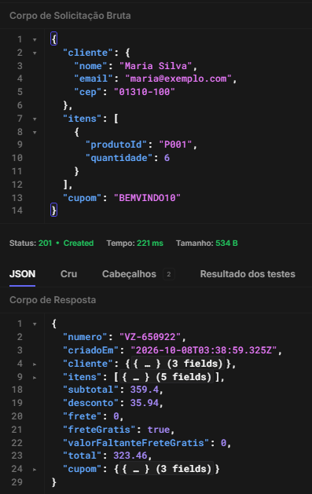

# BUG-002 - API permite quantidade superior ao limite máximo de 5 unidades

## Resumo

A API aceita quantidade superior a 5 unidades do mesmo produto, apesar de a regra de negócio limitar cada produto a no máximo 5 unidades por pedido.

O comportamento ocorre tanto no cálculo do carrinho quanto na confirmação do pedido.

## Critério relacionado

CA10 - Cada produto pode ter no máximo 5 unidades por pedido. A regra vale para a interface e para a API.

## Severidade

Alta

## Ambiente

Verzel Store - Ambiente de QA

## Pré-condição

Utilizar um produto válido disponível na loja.

## Passos para reprodução

1. Enviar uma requisição para o cálculo do carrinho contendo 6 unidades do produto P001.
2. Observar a resposta da API.
3. Enviar um pedido contendo 6 unidades do mesmo produto.
4. Observar a resposta da API.

## Dados utilizados

- Produto: P001 - Camiseta Essencial
- Preço unitário: R$ 59,90
- Quantidade: 6
- Limite permitido: 5 unidades

## Resultado esperado

Ao informar quantidade superior a 5 unidades, a API deve rejeitar a requisição com:

- HTTP Status: 422
- Código: `QUANTIDADE_MAXIMA_EXCEDIDA`

Nenhum pedido com quantidade superior ao limite deve ser confirmado.

## Resultado obtido

### POST /api/carrinho/calcular

A API aceita 6 unidades e responde HTTP 200, realizando normalmente o cálculo do carrinho.

### POST /api/pedidos

A API aceita as mesmas 6 unidades e responde HTTP 201, confirmando o pedido e gerando um número de pedido.

Durante a reprodução foi possível confirmar um pedido com quantidade superior ao limite definido pela regra de negócio.

## Reprodução via API

Payload utilizado no cálculo do carrinho:

```
{
	"itens": [
		{
			"produtoId": "P001",
			"quantidade": 6
		}
	]
}
```

O mesmo item com quantidade 6 também é aceito na criação do pedido.

## Impacto

A ausência da validação permite que pedidos sejam calculados e confirmados com quantidade superior ao limite estabelecido pela regra de negócio.

O problema não está restrito à apresentação dos dados: o endpoint responsável pela confirmação do pedido aceita a operação inválida e retorna sucesso.

## Evidências

### Cálculo do carrinho

A API permite calcular o carrinho com 6 unidades do mesmo produto,
apesar do limite máximo de 5 unidades definido pela regra de negócio.

A requisição retorna HTTP `200 OK` e realiza normalmente o cálculo
das 6 unidades.



### Confirmação do pedido

A API permite a criação de um pedido contendo 6 unidades do mesmo produto,
apesar do limite máximo de 5 unidades definido pela regra de negócio.

A requisição foi processada com sucesso e retornou HTTP `201 Created`,
incluindo a geração de um número de pedido.



### Automação

O defeito possui cenários automatizados de reprodução na suíte `known-bugs`.
